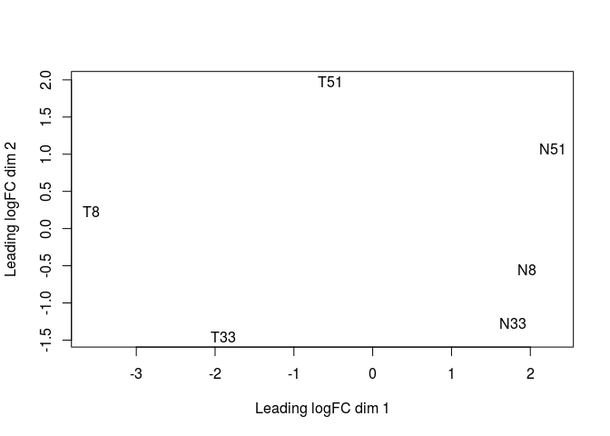
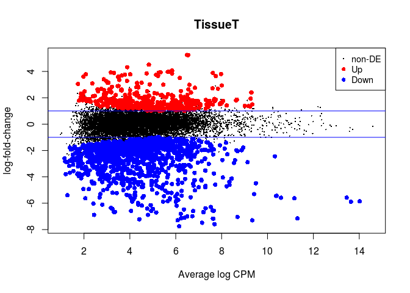
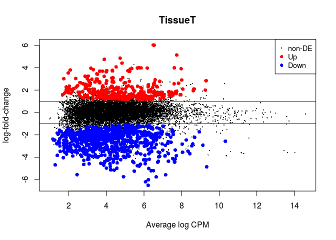

Here we demonstrate the use of *edgeR* to perform a differential expression analysis using data from Tuch *et al.* ([PLOS](http://journals.plos.org/plosone/article?id=10.1371/journal.pone.0009317)) as detailed in the edgeR manual.

The data is a set of RNA-seq samples of oral squamous cell carcinomas and matched normal tissue from three patients that were previously quantified into raw counts. 

We will use *edgeR* to do a differential expression analysis of Tumor vs Non-Tumor samples. We will start with a simple pairwise comparison of the Tumor and Non-Tumor samples, and then repeat the analysis adding the patient pairing information to the model design.

# Load the count data

We start by importing the counts table into R using the `read.delim` function. Other functions to import tables include `read.table` and `read.csv`. We also specify that the values in the tables are separated by a TAB. You can type `?read.delim` in the R console to display the documentation of the function.


```r
rawdata <- read.delim("edgeR_example1_Tuch.tab", sep = "\t")
```

To check that the data was loaded properly we can use functions such as `head` (to displays the first lines of the table), `dim` (to display the dimensions of the table) and `summary` (to display summary statistics for each column). In RStudio you can also type `View(rawdata)` to view the full table on a separate window.


```r
head(rawdata)
```

```
##       idRefSeq   N8 T8   N33 T33   N51  T51
## 1    NM_182502 2592  3  7805 321  3372    9
## 2    NM_003280 1684  0  1787   7  4894  559
## 3    NM_152381 9915 15 10396  48 23309 7181
## 4    NM_022438 2496  2  3585 239  1596    7
## 5 NM_001100112 4389  7  7944  16  9262 1818
## 6    NM_017534 4402  7  7943  16  9244 1815
```

```r
dim(rawdata)
```

```
## [1] 15668     7
```

```r
summary(rawdata)
```

```
##       idRefSeq           N8                 T8                N33        
##  NM_000014:    1   Min.   :     2.0   Min.   :     0.0   Min.   :     1  
##  NM_000016:    1   1st Qu.:   119.0   1st Qu.:    88.0   1st Qu.:   143  
##  NM_000017:    1   Median :   256.0   Median :   219.0   Median :   291  
##  NM_000018:    1   Mean   :   771.6   Mean   :   646.2   Mean   :  1270  
##  NM_000019:    1   3rd Qu.:   562.0   3rd Qu.:   503.0   3rd Qu.:   622  
##  NM_000020:    1   Max.   :393801.0   Max.   :330105.0   Max.   :581364  
##  (Other)  :15662                                                         
##       T33              N51               T51        
##  Min.   :     0   Min.   :      5   Min.   :     0  
##  1st Qu.:   171   1st Qu.:    317   1st Qu.:   223  
##  Median :   379   Median :    679   Median :   494  
##  Mean   :  1186   Mean   :   2162   Mean   :  1394  
##  3rd Qu.:   828   3rd Qu.:   1479   3rd Qu.:  1100  
##  Max.   :365430   Max.   :1675945   Max.   :633871  
## 
```

# Exploring general characteristics of the raw data

Before we go further in the analysis, it's good practice to inspect the general characteristics of the data. This will allow us to make informed choices on further analysis steps, as well as prevent mistakes.

For convenience, we separate the table in two: one containing the counts for all samples (columns 2 to 7), and another containing only the list of gene names (column 1).


```r
rawcounts <- rawdata[, 2:7]
genes <- rawdata[, 1]
```

The next expression checks for missing values is the count data. There are no missing values.


```r
all(is.na(rawcounts) == FALSE)
```

```
## [1] TRUE
```

We then inspect the total number of reads in each sample (or column). We can do this with the `colSums` function. We can also pass these totals to the barplot function to quickly visualize them. 


```r
colSums(rawcounts)
```

```
##       N8       T8      N33      T33      N51      T51 
## 12090121 10123913 19890767 18590376 33878462 21832978
```

```r
barplot(colSums(rawcounts), ylab="Total number of reads", xlab="Sample ID")
```

<!-- -->

`ggplot2` is a popular graphics library for R that allows us to make more complex visualizations. Here we plot the distributions of counts in each sample as boxplots, and as density plots. *Note that ggplot2 warns us that some values could not represented in the plot, due to the logarithmic transformation.*


```r
library(ggplot2)
library(reshape2)

ggplot(melt(rawcounts, measure.vars = 1:6), aes(y=value, x=variable, col=variable)) + 
  geom_boxplot() +                                    # we want a boxplot
  scale_y_log10()                                     # y scale is log10
```

```
## Warning: Transformation introduced infinite values in continuous y-axis
```

```
## Warning: Removed 112 rows containing non-finite values (stat_boxplot).
```

<!-- -->

```r
ggplot(melt(rawcounts, measure.vars = 1:6), aes(x=value, col=variable)) + 
  geom_density() +                                    # we want a density plot
  scale_x_log10()                                     # x scale is log10
```

```
## Warning: Transformation introduced infinite values in continuous x-axis
```

```
## Warning: Removed 112 rows containing non-finite values (stat_density).
```

<!-- -->

We can also inspect sample-to-sample correlations using the `cor` function. This will produce a matrix correlations for all pairs of samples. By default, `cor` calculates the Pearson correlation coefficient between samples. Often, it is useful to compare this with a more robust metric, such as the rank-based Spearman correlation.

Additionally, when working with gene expression data, it is better to first transform the raw counts to log counts, to avoid the correlations being artificially determined by just a few very expressed genes.


```r
log10_rawcounts <- log10(rawcounts + 1)

cor(log10_rawcounts, method="pearson")
```

```
##            N8        T8       N33       T33       N51       T51
## N8  1.0000000 0.6719782 0.9085507 0.7448667 0.8793487 0.7854465
## T8  0.6719782 1.0000000 0.6487462 0.8374555 0.6102290 0.7799513
## N33 0.9085507 0.6487462 1.0000000 0.7593882 0.8351785 0.7730180
## T33 0.7448667 0.8374555 0.7593882 1.0000000 0.6728919 0.8150082
## N51 0.8793487 0.6102290 0.8351785 0.6728919 1.0000000 0.7951608
## T51 0.7854465 0.7799513 0.7730180 0.8150082 0.7951608 1.0000000
```

A useful visualization here is to display this correlation matrix as a heatmap. Here we display heatmaps of Pearson and Spearman correlations using the built-in `heatmap` function. The `heatmap` function will also apply hierarquical clustering to the matrix in order to group together the more similar samples.


```r
heatmap(as.matrix(cor(log10_rawcounts, method="pearson")), 
        main="Clustering of Pearson correlations", scale="none")
```

<!-- -->

```r
heatmap(as.matrix(cor(log10_rawcounts, method="spearman")), 
        main="Clustering of Spearman correlations", scale="none")
```

<!-- -->

# Simple pairwise differential expression analysis with edgeR 

We need to import edgeR into the R environment.


```r
library(edgeR)
```

```
## Loading required package: limma
```

We start by telling edgeR where our raw counts are, and calculate normalization factors.


```r
y <- DGEList(counts=rawcounts, genes=genes)
y <- calcNormFactors(y)

y$samples
```

```
##     group lib.size norm.factors
## N8      1 12090121    1.0746801
## T8      1 10123913    1.1050377
## N33     1 19890767    0.7446805
## T33     1 18590376    1.0271063
## N51     1 33878462    0.9385600
## T51     1 21832978    1.1729954
```

We can get the normalized counts using the `cpm` function. Compare the distributions of these CPM with the ones we generated from the raw counts.


```r
cpms <- as.data.frame(cpm(y, normalized.lib.sizes = TRUE))

ggplot(melt(cpms, measure.vars = 1:6), aes(x=value, col=variable)) + 
  geom_density() +                                    # we want a density plot
  scale_x_log10()                                     # x scale is log10
```

```
## Warning: Transformation introduced infinite values in continuous x-axis
```

```
## Warning: Removed 112 rows containing non-finite values (stat_density).
```

<!-- -->

```r
ggplot(melt(cpms, measure.vars = 1:6), aes(y=value, x=variable, col=variable)) + 
  geom_boxplot() +                                    # we want a boxplot
  scale_y_log10()                                     # y scale is log10
```

```
## Warning: Transformation introduced infinite values in continuous y-axis
```

```
## Warning: Removed 112 rows containing non-finite values (stat_boxplot).
```

<!-- -->

After normalization, we can now produce a Multidimensional Scaling Plot (MDS) using the function `plotMDS`. This visualization places the samples on a plane such that more similar samples appear closer together. We can immediately notice that the tumor samples are separated from the non-tumor samples on the first component (x axis), and that they appear to display more variability than the non-tumor samples.


```r
plotMDS(y)
```

<!-- -->

We now define the design of our comparison. We want to compare Tumor to Non-Tumor samples.


```r
Tissue <- factor(c("N","T","N","T","N","T"))

design <- model.matrix(~Tissue)
rownames(design) <- colnames(y)

design
```

```
##     (Intercept) TissueT
## N8            1       0
## T8            1       1
## N33           1       0
## T33           1       1
## N51           1       0
## T51           1       1
## attr(,"assign")
## [1] 0 1
## attr(,"contrasts")
## attr(,"contrasts")$Tissue
## [1] "contr.treatment"
```

Next we use this design to conduct the test of differential expression. In *edgeR*, this is done in 3 steps: estimation of the negative binomial dispersions (`estimateDisp`), fitting of the negative binomial model to the count data (`glmFit`) and hypothesis testing (`glmLRT`).


```r
y <- estimateDisp(y, design, robust=TRUE)
fit <- glmFit(y, design)
lrt <- glmLRT(fit)
```

We now check how many genes were differentially expressed.


```r
summary(decideTestsDGE(lrt))
```

```
##        TissueT
## Down       956
## NotSig   14335
## Up         377
```

A common visualization of differential expression results is *MA-plot* that displays the relationship between a genes' mean expression and its fold-change between experimental conditions. In *edgeR* this is done with the `plotMD` function. Up-regulated genes are indicated in red, and down-regulated genes are indicated in blue. The horizontal lines indicate 2x fold-changes.


```r
plotMD(lrt)
abline(h=c(-1, 1), col="blue")
```

<!-- -->

We can retrieve a table with all the results of differential expression using the `topTags` function. We also save it to a file so we can latter open it in Excel.


```r
result <- as.data.frame(topTags(lrt, n = nrow(rawcounts)))

head(result)
```

```
##           genes     logFC   logCPM       LR       PValue          FDR
## 15660 NM_198964  3.969929 5.653315 70.20133 5.355024e-17 8.390251e-13
## 102   NM_004320 -4.472638 5.464585 66.53939 3.429713e-16 2.176337e-12
## 103   NM_173201 -4.462351 5.454729 66.15553 4.167099e-16 2.176337e-12
## 200   NM_031469 -4.022319 5.038015 64.88296 7.948160e-16 3.033213e-12
## 53    NM_005609 -5.241483 5.485800 64.49462 9.679643e-16 3.033213e-12
## 15654 NM_198966  3.872656 5.256142 63.37970 1.704659e-15 4.451432e-12
```

```r
write.table(result, file = "edgeR_Tuch_Tumor_vs_NonTumor.csv", sep="\t", row.names = FALSE)
```

# A more complex design: adding patient pairing information

Recall that tumor and non-samples were collected from 3 patients. Until now we have ignored this information in our design. Here we repeat the analysis by adding the sample pairing information to our model design, that will allow us to adjust for differences between patients.

*Note that we only need to change our design definition. The rest of the commands are exactly the same as above.*


```r
Patient <- factor(c(8, 8, 33, 33, 51, 51))
Tissue <- factor(c("N","T","N","T","N","T"))

design <- model.matrix(~Patient + Tissue)
rownames(design) <- colnames(y)

design
```

```
##     (Intercept) Patient33 Patient51 TissueT
## N8            1         0         0       0
## T8            1         0         0       1
## N33           1         1         0       0
## T33           1         1         0       1
## N51           1         0         1       0
## T51           1         0         1       1
## attr(,"assign")
## [1] 0 1 1 2
## attr(,"contrasts")
## attr(,"contrasts")$Patient
## [1] "contr.treatment"
## 
## attr(,"contrasts")$Tissue
## [1] "contr.treatment"
```

```r
y <- DGEList(counts=rawcounts, genes=genes)
y <- calcNormFactors(y)
y <- estimateDisp(y, design, robust=TRUE)
fit <- glmFit(y, design)
lrt <- glmLRT(fit)

de <- decideTestsDGE(lrt)
summary(de)
```

```
##        TissueT
## Down      1430
## NotSig   13740
## Up         498
```

```r
plotMD(lrt)
abline(h=c(-1, 1), col="blue")
```

<!-- -->

```r
result_paired <- as.data.frame(topTags(lrt, n = nrow(rawcounts)))
write.table(result_paired, file = "edgeR_Tuch_Tumor_vs_NonTumor_paired.csv", sep="\t", row.names = FALSE)
```

# Putting it all together

To summarize, the workflow for differential expression analysis in R using *edgeR* is usually comprised of the following steps:

1. Loading the count data (`?read.delim`).
2. Inspection of the count data through summarization and visualization (`?summary`, `?plot`, ...).
3. Initialization of the *edgeR* structure (`?DGEList`)
4. Normalization of the count data to CPM (`?calcNormFactors`).
5. Definition of the design matrix (`?model.matrix`).
6. Estimation of the negative binomial dispersions (`?estimateDisp`).
7. Fitting of the negative binomial model to the count data (`?glmFit`).
8. Hypothesis testing (`?glmLRT`).
9. Obtaining the table with results and saving to a file (`?topTags`).


